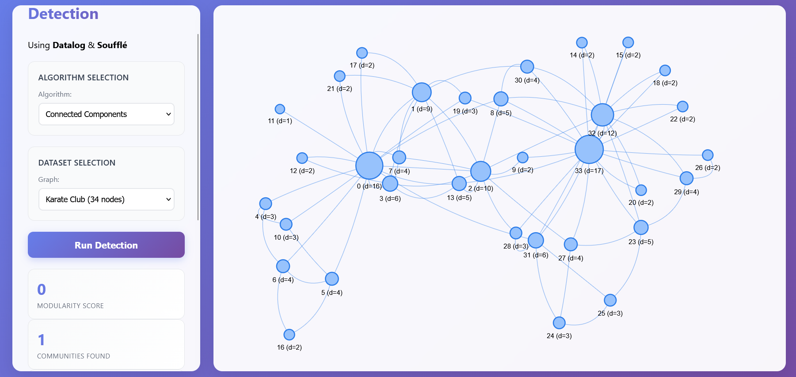

# 🌐 Détection de Communautés dans les Réseaux Sociaux via Datalog

[](https://www.docker.com/)
[](https://www.python.org/)
[](https://souffle-lang.github.io/)

Une plateforme de pointe pour la détection de communautés qui combine la puissance déclarative de **Datalog** avec un backend moderne **Flask** et un frontend **Vis.js**. Ce projet démontre l'analyse de graphes haute performance via la programmation logique.

---

## 🏛️ Informations du Projet

- **Université :** Université de Boumerdès (UMBB)
- **Département :** Département d’Informatique
- **Cours :** Logique et Bases de Données
- **Étudiant :** Afrit Mohamed Rayan
- **Encadrant :** Mr. C. Salmi

---

## 📽️ Aperçu


*Interface moderne avec visualisation dynamique des graphes et contrôles de physique.*

---

## 🚀 Fonctionnalités Clés

### 🧠 Algorithmes Avancés
- **Label Propagation (LPA)** : Algorithme itératif où les nœuds adoptent le label majoritaire de leurs voisins.
- **Composantes Connexes** : Utilise la fermeture transitive pour identifier les sous-graphes isolés.
- **Tiers de Centralité** : Classe les nœuds en "Hubs" ou "Périphérie" selon leur degré de centralité.

### 📊 Jeux de Données Inclus
- **Karate Club** : Le classique benchmark de 34 nœuds.
- **Dolphin Network** : Interactions sociales entre 62 dauphins.
- **Les Misérables** : Réseau de co-apparition des personnages (77 nœuds).
- **Football** : Réseau des matchs NCAA illustrant les clusters d'équipes.

### 📈 Métriques Datalog Natives
Calculées directement dans le moteur Soufflé pour une performance optimale :
- **Score de Modularité (Q)** : Mesure quantitative de la qualité du partitionnement.
- **Comptage de Triangles** : Détection efficace de motifs de sous-graphes.
- **Centralité de Degré** : Métriques de connectivité par nœud.

---

## 🛠️ Architecture

L'application repose sur un modèle "Logic + Glue" :

1.  **Couche Logique (Soufflé Datalog)** : Gère tout le traitement de graphes, la reachability et les calculs statistiques.
2.  **Couche d'Orchestration (Python/Flask)** : Gère le cycle de vie, le parsing des données et les endpoints API.
3.  **Couche de Visualisation (Vis.js)** : Offre un canevas interactif pour l'exploration des structures.
4.  **Environnement (Docker)** : Garantit une exécution cohérente sur toutes les plateformes.

---

## 🚦 Démarrage Rapide

### Prérequis
- [Docker Desktop](https://www.docker.com/products/docker-desktop/) installé et configuré.

### Installation et Exécution

1.  **Cloner le dépôt** :
    ```bash
    git clone https://github.com/afrit-med-rayan/Community-Detection-with-Datalog.git
    cd Community-Detection-with-Datalog
    ```

2.  **Lancer avec Docker Compose** :
    ```bash
    docker-compose up --build
    ```

3.  **Accéder au Dashboard** :
    Ouvrez votre navigateur sur : [**http://localhost:5000**](http://localhost:5000)

---

## 🧪 Tests

Exécutez la suite de tests automatisés pour vérifier la logique Datalog :

```bash
python -m pytest tests/test_datalog.py
```

---

## 📄 Documentation

- [**Rapport Académique (PDF)**](docs/bda_repport.pdf) : Version finale du rapport (Recherche, Méthodologie, Résultats).
- [**Source LaTeX**](docs/rapport_final.tex) : Code source pour la compilation du rapport.

---

## 📝 Licence

Distribué sous licence MIT. Voir `LICENSE` pour plus de détails.

---
**Auteur :** Afrit Mohamed Rayan | **Cours :** Logique et Bases de Données 2025
